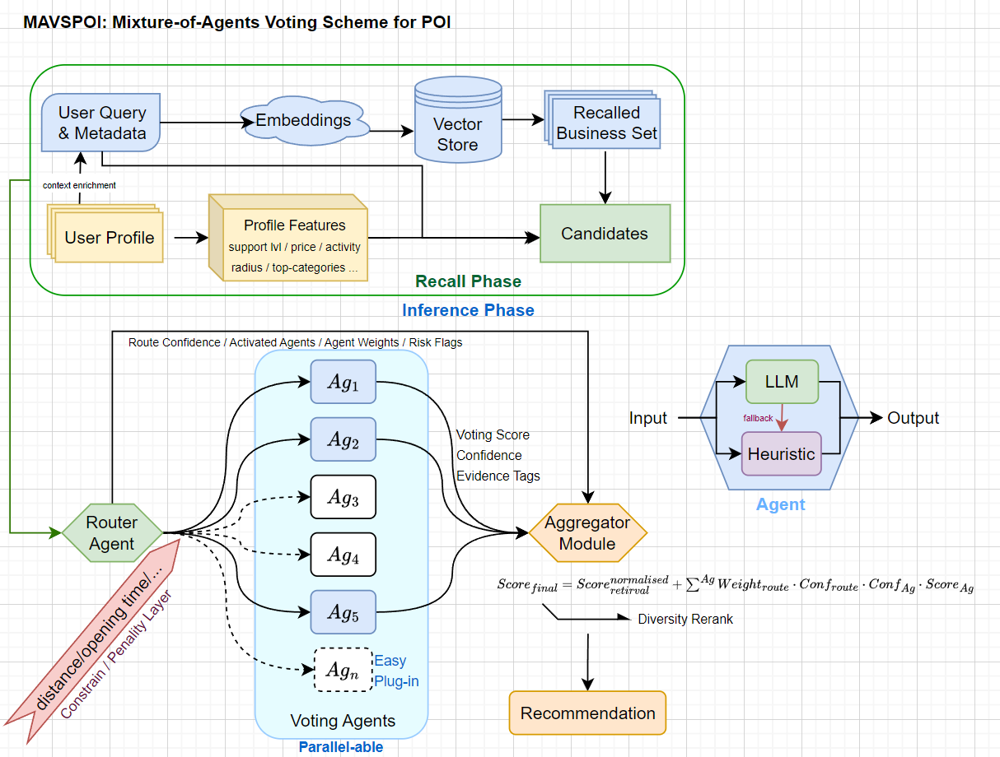

# MAVSPOI

**MAVSPOI = Mixture-of-Agents Voting Scheme for context-aware query-based POI Recommendation**



This repo now contains:
- A preserved **CoMaPOI-styled baseline** (`CoMaPOI_styled/*`).
- A **Non-LLM Recall+Rerank baseline** (`Recall_Rerank/*`) using listwise CE reranking.
- An **LLM4POI (API-LLM adapted) baseline** (`LLM4POI/*`) with trajectory prompting + key-query similarity.
- A modular **MAVSPOI implementation in `src/`** with:
  - Hybrid Calibration Router
  - Chain-of-thought (internal) Voting Agents A1~A7
  - Parallel voting execution
  - Deterministic Aggregator

## 1. What Is Implemented Now

### 1.1 MAVSPOI Runtime (src-level)
- `src/mavspoi_pipeline.py`: end-to-end orchestration
- `src/agents/router_agent.py`: Hybrid Calibration Router
- `src/agents/agent_registry.py`: voting-agent registration for Router/Aggregator
- `src/agents/aggregator_agent.py`: deterministic score fusion
- `src/agents/llm_voting_base.py`: shared CoT voting base
- `src/agents/*_agent.py`: A1~A7 expert modules

### 1.2 Shared Components Reused
- `src/retrieval.py`: FAISS retrieval + retrieval score fusion
- `src/openai_client.py`: OpenAI chat JSON + embeddings
- `src/profile_loader.py`, `src/yelp_loader.py`, `src/schemas.py`
- `utils/build_eval_protocol.py`, `utils/build_user_profile.py`

### 1.3 Main Entrypoint
- `main.py` provides:
  - `query` subcommand
  - `eval` subcommand

## 2. Architecture (Current)

### 2.1 End-to-End Flow
1. Retrieval from FAISS (`src/retrieval.py`)
2. Router decides active experts with Hybrid Calibration
3. Activated voting experts run in parallel
4. Aggregator fuses retrieval + votes into final ranking

### 2.2 Router: Hybrid Calibration
Router combines:
- heuristic routing score
- LLM routing score (optional, enabled by default)
- prior from configured agent weights

It calibrates mixture weights by:
- profile reliability (`warm` / `few_shot` / `zero_shot`)
- query clarity (token richness)

Output:
- `activated_agents` with calibrated weight/confidence
- `global_constraints` (`city/state/open_now/max_distance_km`)
- `risk_flags`

### 2.3 Voting Agents: CoT Reasoning + Calibration
All A1~A7 experts use:
- LLM internal chain-of-thought style reasoning (hidden, JSON output only)
- heuristic fallback scoring
- per-agent blend of LLM score and heuristic score

Experts:
- A1 Spatial Feasibility
- A2 Temporal Feasibility
- A3 Intent Matching
- A4 Stable Preference
- A5 Exploration
- A6 Availability-Reliability
- A7 Purpose-Modality

### 2.4 Parallel Voting
Voting is executed with a thread pool in `src/mavspoi_pipeline.py`:
- configurable `parallel_workers`
- per-agent failure isolation (failed agent does not break full request)

### 2.5 Aggregator
Deterministic weighted fusion:
- retrieval component
- activated expert contributions (`weight * confidence * score`)
- optional diversity penalty via greedy rerank

## 3. Agent Registry

`src/agents/agent_registry.py` is the canonical registry.

It:
- registers all voting agents
- exposes specs to Router
- provides agent lookup for voting execution

Compatibility file for requested naming:
- `src/agents/agent-registry.py`

## 4. Config

Settings are read from `config.yaml` (`runtime` + `mavspoi` sections), with optional env override for runtime keys.

Optional env var:
- `CONFIG_YAML_PATH=...` to point to another YAML file.
- `OPENAI_BASE_URL=...` to target an OpenAI-compatible API endpoint.
- `OPENAI_API_PORT=...` optional port override for `OPENAI_BASE_URL` (or local default `http://127.0.0.1:<PORT>/v1` when base URL is empty).

## 5. Run

### 5.1 Single Query
```bash
python main.py query ^
  --query "Need a quiet cafe with wifi for working near me" ^
  --user-id "<uid>" ^
  --city "Indianapolis" ^
  --state "IN" ^
  --lat 39.7684 ^
  --lon -86.1581
```

### 5.2 Batch Eval
Constrained mode:
```bash
python main.py eval --mode constrained --eval-queries data/eval/yelp-indianapolis-eval-queries.jsonl --eval-candidates data/eval/yelp-indianapolis-eval-candidates.jsonl --k-values 1,5,10
```

Full mode (--max-queries for smoke tests):
```bash
python main.py eval --mode full --eval-queries data/eval/yelp-indianapolis-eval-queries.jsonl --k-values 1,5,10 --max-queries 100
```

## 6. Evaluation Compatibility

Fair-comparison assets remain unchanged:
- Train/eval split protocol
- Candidate generation protocol
- Profile construction protocol
- Metrics (`Hit@K`, `Recall@K`, `NDCG@K`, `MRR@K`)

So results are directly comparable against baseline folders such as
`CoMaPOI_styled/*`, `Recall_Rerank/*`, and `LLM4POI/*`.
